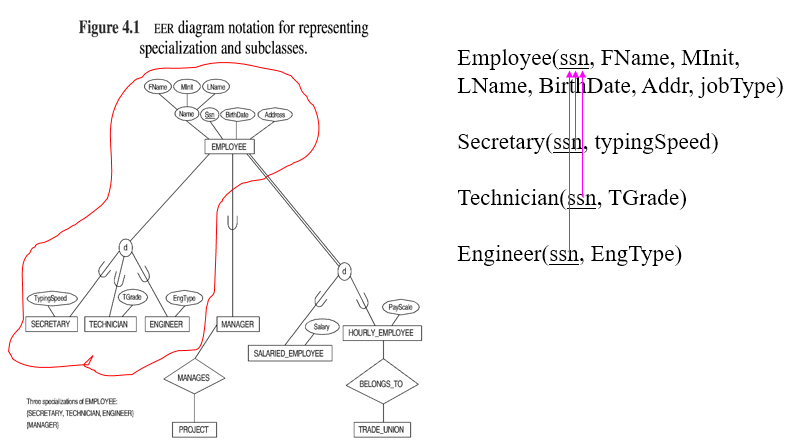
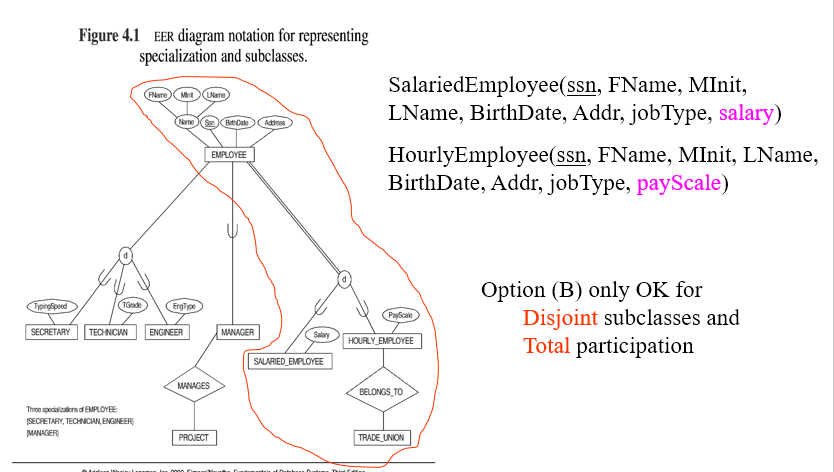

# Week 7 Notes
## Mapping ERD to tables

### General Rules
- Each entity maps to it's own relation
- In many cases tables with the same primary key can be merged
- Mapping rules aim to generate tables with less null values and less redundancy

### Strong Entities
- Map to a table with the same PK
    - Include all simple attributes
    - __Derived attributes are usually omitted__
    - each multi-valued attribute is usually put in a separate table

### Weak Entities
- Maps to a table, the PK is a partial key and the primary key of the owner entity

### Many to Many M:M Relations
- Map to a separate relation
    - Includes of attributes and PKS of participating entities
    - PK may also have some relationship attribute
    - PK of entities are FK's to those entities

### 1:M Relations
- Add PK of table on 1-side and attributes of relationship to table of M side

### 1:1 Relations | Mandatory Participation
- Merge the tables for both entities
    - Include attributes of the relationship

### 1:1 Relations | Mandatory on One Side
- Put PK of optional side and attributes of relationship into the table of the mandatory side

### Unary Relationships
- Follow the rules for binary relations
- Imagine there is another copy of the entity

### Sample Mappings
```js
employee(ssn, bdate, fname, Mint, Lname, address, salary, sex, supervisorSSN, deptNum)
FK: supervisorSSN ref ssn; 
       deptNum ref department (deptNum)

department(deptNum,deptName, MngSSN, MngStart_date)
FK: MngSSN ref employee (ssn) 

DeptLocation(location, deptNum)
FK: deptNum ref department(deptNum)
```

### Class and Subclass
- Relationships between a class and its subclasses are called __ISA relationships__
- An ISA Relationship can either be
    - Total or partial
    - Disjoint or overlapping
- Disjoint classes are represented by a (d)
- Overlapping classes are represented by an (o)
> For each subclass only draw its special attributes


### Subclass Hierarchies
- Subclass may have further subclasses.
- Therefore a subclass may have several super classes (Which must have the same __key__).

### Mapping Subclass Hierarchies to Tables
- Option (A) 
    - Create a relation for the superclass, and a relation for each of the subclasses. 
    - The relation for superclass is S(K, a1,…,an)
    - The relation for subclass B is B(K, b1,…,bm)
    - K is a FK of B referencing S(K).

- Option (B)
    - Create a relation  for each subclass B
    - The relation B is B(K, a1,…,an, b1,…,bm)

> DO NOT MIX OPTION A/B FOR THE SAME SUPER CLASS!


